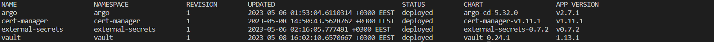

# Todo Full Stack Deployment
Introducing a full deployment cycle for events app deployed on Kubernetes using the ArgoCD tool and Helm charts. it uses AngularJS as a Frontend framework connected to Express.js as a backend web framework and it interacts with MongoDB to retrieve or store data. using Hashicorp vault to store the application secrets & validating certificates for the application ingress, External secret operator for creating the secrets along with the vault, and Github actions as a pipeline for building & pushing the backend & frontend image to GitHub package registry and for updating each image tag on the app charts for main, stage, dev branches according to each branch case. then Argo triggers the new commits and updates each app manifests.

# Application components

- MongoDB - A NoSQL database.
- ExpressJS -  A backend web application framework for NodeJS.
- Angular - A JavaScript-based front-end web development framework for building dynamic, single-page web applications.
- NodeJS - A JavaScript runtime environment that enables running JavaScript code outside the browser, among other things.

how the different components of the app might work together:

- A user visits the event posting app’s website on their browser.
AngularJS, the frontend framework, retrieves the necessary HTML, CSS, and JavaScript files from the server and renders the initial view of the website.
- When the user wants to view a list of events or create a new event, AngularJS sends an HTTP request to the backend server.
- Express.js, the backend web framework, receives the request and processes it. This step includes interacting with the MongoDB database to retrieve or store data and providing an API for the frontend to access the data.
- The back-end server sends a response to the frontend, which AngularJS receives and uses to update the view.
- When a user creates a new event, AngularJS sends a POST request to the backend server, which Express.js receives and processes. Express.js stores the new event in the MongoDB database.
- The backend server sends a confirmation response to the front-end, which AngularJS receives and uses to update the view and display the new event.
- Node.js, the JavaScript runtime, handles the server-side logic for the application and allows for real-time updates. This includes running the Express.js server, handling real-time updates using WebSockets, and handling any other server-side tasks.Node-based Express server.

# Helm setup
- Helm is always the best choice for me to deploy any component I need inside  the cluster with customized values, during the project, I used some helm packages I would like to describe them:
    - Cert-manager
        - for being able to deploy issuer & certificate manifests that are required for ingress to be secured with HTTPS protocol.
    - Hashicorp-Vault 
        - for deploying the secrets required by each app in my case I stored the private registry credentials that are required for each container to access & pull the images.
        - issuer reference for creating a valid certificate for ingress.
    - External-secrets
        - for handling the secrets inside each namespace, I used it to deploy a secret store connected with the vault to retrieve any secrets required by any application on any namespace.
    - Argo
        - for deploying the argo stack with custom values.

# GitHub actions cycle
- The repo has 3 branches: `Main` - `Stage` - `Dev` Each branch will have 3 folders:
    - Backend - the Backend code of the application.
    - Frontend - the Frontend code of the application.
    - App-charts - the application manifests are built with custom helm charts.
- I built a custom workflow for each folder to trigger any commits that will be pushed by developers.
- Let's say that we have 2 teams working on the app stack, the Backend team and the frontend team.
- Each team tries to release a new feature on the dev branch the backend team tries to release a feature on the Backend code and the same for the frontend team.
- If the backend team made a commit on `backend/` folder, the Backend workflow will trigger that commit and will automatically run the pipeline to build the backend image and then upload it to the Github packages registry.
- Same previous steps for `Frontend/` folder.
- Each workflow is configured to update image tags on the app helm charts according to each branch.
- For example, if the commit happened on the frontend code folder on the stage branch. the frontend workflow will trigger that commit and will build the frontend image then update the new frontend tag image on the app helm charts value on the stage branch with a custom commit msgs describing the updated image if `backend` / `frontend` with the commit version.
- Same previous step will work for the other branches / folders.

# Argo cycle

- I deployed 3 apps on Argo, each app deployed from the app charts on each branch.
- Argo is configured to watch the app charts on each branch.
- Argo will trigger and fetch the new updates for any branch in my case after the GitHub actions will update the tag on folder A branch A, Argo will detect the new tag for the app which been deployed from this branch and will ask for update the app manifests with the new tag.
- each pod using the registry credentials will be asked to authenticate & pull the new image tag and do a rolling update.
 
# App helm charts
- I generated custom helm charts for the app stack which can be helpful to deploy the app on different namespaces with custom configurations and capacity. a good idea to deploy the app without shared resources conflict with Argo. This is also helpful for dynamically changing the application values live without any problems.