# Todo Full Stack Deployment
Introducing a full deployment cycle for events app deployed on Kubernetes using the ArgoCD tool and Helm charts. it uses AngularJS as a Frontend framework connected to Express.js as a backend web framework and it interacts with MongoDB to retrieve or store data. using Hashicorp vault to store the application secrets & validating certificates for the application ingress, External secret operator for creating the secrets along with the vault, and Github actions as a pipeline for building & pushing the backend & frontend image to GitHub package registry and for updating each image tag on the app charts for main, stage, dev branches according to each branch case. then Argo triggers the new commits and updates each app manifests.

# Application components

- MongoDB - A NoSQL database.
- ExpressJS -  A backend web application framework for NodeJS.
- Angular - A JavaScript-based front-end web development framework for building dynamic, single-page web applications.
- NodeJS - A JavaScript runtime environment that enables running JavaScript code outside the browser, among other things.

how the different components of the app might work together:

- A user visits the event posting app’s website on their browser.
AngularJS, the frontend framework, retrieves the necessary HTML, CSS, and JavaScript files from the server and renders the initial view of the website.
- When the user wants to view a list of events or create a new event, AngularJS sends an HTTP request to the backend server.
- Express.js, the backend web framework, receives the request and processes it. This step includes interacting with the MongoDB database to retrieve or store data and providing an API for the frontend to access the data.
- The back-end server sends a response to the frontend, which AngularJS receives and uses to update the view.
- When a user creates a new event, AngularJS sends a POST request to the backend server, which Express.js receives and processes. Express.js stores the new event in the MongoDB database.
- The backend server sends a confirmation response to the front-end, which AngularJS receives and uses to update the view and display the new event.
- Node.js, the JavaScript runtime, handles the server-side logic for the application and allows for real-time updates. This includes running the Express.js server, handling real-time updates using WebSockets, and handling any other server-side tasks.Node-based Express server.

# Helm setup
- Helm is always the best choice for me to deploy any component I need inside  the cluster with customized values, during the project, I used some helm packages I would like to describe them:
    - Cert-manager
        - for being able to deploy issuer & certificate manifests that are required for ingress to be secured with HTTPS protocol.
    - Hashicorp-Vault 
        - for deploying the secrets required by each app in my case I stored the private registry credentials that are required for each container to access & pull the images.
        - issuer reference for creating a valid certificate for ingress with custom domain `todo.com`.
    - External-secrets
        - for handling the secrets inside each namespace, I used it to deploy a secret store connected with the vault to retrieve any secrets required by any application on any namespace.
    - Argo
        - for deploying the argo stack with custom values.

# GitHub actions cycle
- The repo has 3 branches: `Main` - `Stage` - `Dev` Each branch will have 3 folders:
    - Backend - the Backend code of the application.
    - Frontend - the Frontend code of the application.
    - App-charts - the application manifests are built with custom helm charts.
- I built a custom workflow for each folder to trigger any commits that will be pushed by developers.
- Let's say that we have 2 teams working on the app stack, the Backend team and the frontend team.
- Each team tries to release a new feature on the dev branch the backend team tries to release a feature on the Backend code and the same for the frontend team.
- If the backend team made a commit on `backend/` folder, the Backend workflow will trigger that commit and will automatically run the pipeline to build the backend image and then upload it to the Github packages registry.
- Same previous steps for `Frontend/` folder.
- Each workflow is configured to update image tags on the app helm charts according to each branch.
- For example, if the commit happened on the frontend code folder on the stage branch. the frontend workflow will trigger that commit and will build the frontend image then update the new frontend tag image on the app helm charts value on the stage branch with a custom commit msgs describing the updated image if `backend` / `frontend` with the commit version.
- The same previous step will work for the other branches / folders.
- After setting the app charts update, the GitHub actions will generate a new release package zipped with a new update on the GitHub release section configured with the branch name, and image tag.

# Argo cycle

- I deployed 3 apps on Argo, each app deployed from the app charts on each branch.
- Argo is configured to watch the app charts on each branch.
- Argo will trigger and fetch the new updates for any branch in my case after the GitHub actions will update the tag on folder A branch A, Argo will detect the new tag for the app which been deployed from this branch and will ask for update the app manifests with the new tag.
- each pod using the registry credentials will be asked to authenticate & pull the new image tag and do a rolling update.
 
# Application helm charts
- I generated custom helm charts for the app stack which can be helpful to deploy the app on different namespaces with custom configurations and capacity. a good idea to deploy the app without shared resources conflict with Argo. This is also helpful for dynamically changing the application values live without any problems.
- Helm charts of the app have these features:
    - ability to set vault credentials value from Argo.
    - ability to adjust the persistent volume & claim of the database.
    - ability to set a custom subdomain with the domain name `todo.com` verified by the Vault issuer.
    - all the global resources which not namespaced will have a custom name according to the hostname, for example, ingress and all its components names like issuer, and cert-manager. database mounted volume names, cluster secret store. all these resources will have a unique name with only the hostname value.
    - ability to scale up/down the replica number for each app.
    - ability to set up the database service name for the Mongo-express web app so it can connect to the right database and visualize it.
    - ability to set up the image repository & tag name for front & backend deployment. this will be customized dynamically by GitHub actions.
- The great point here that Argo supports the values setup during the app deployment. this is great for some options like vault tokens or even any another credentials.

# Full cycle test

- First, the vault helm charts must be installed and set up with application credentials & the domain which will be used for ingress.
- added credentials for the GitHub package registry.

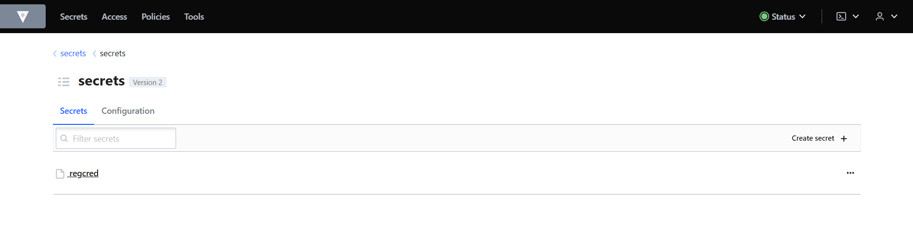

- Setting up the PKI secrets engine with a custom role to generate dynamic certificates for a custom domain, in my case i added `todo.com` as a custom domain. - this role is configured with a custom service account authorized with PKI to request the certificates with the issuer.

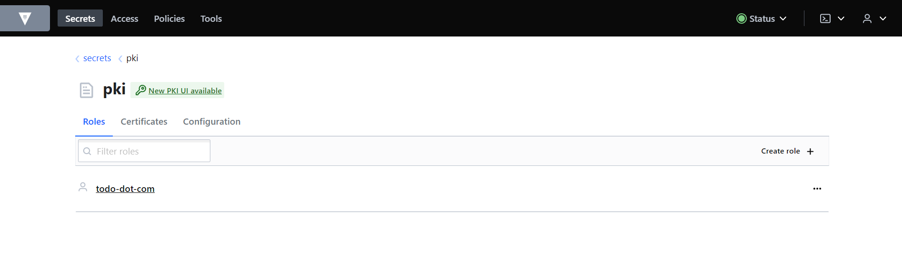

- Installing External-secrets helm charts, I will set up the authentication between ESO and vault during Argo.

- After that, I can deploy 3 apps from each branch, each app will be deployed on a different namespace, configured with custom values according to each branch name and also with a vault token. for example, this is the main app.

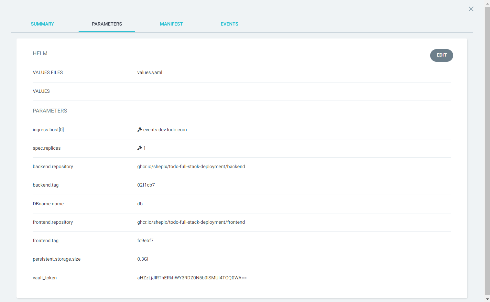

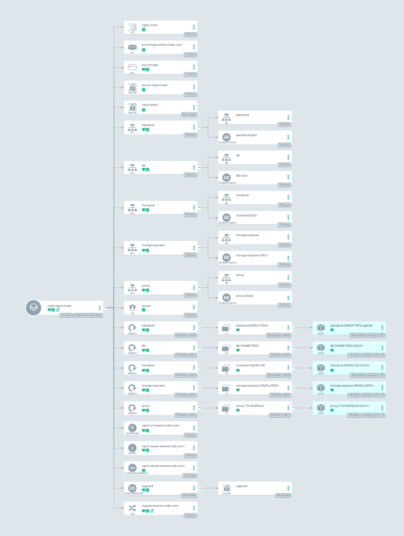

- After deploying each app, i can check the ingress if it got the certificates and the issuer was able to connect & authenticate with vault or not.
- From issuer pod

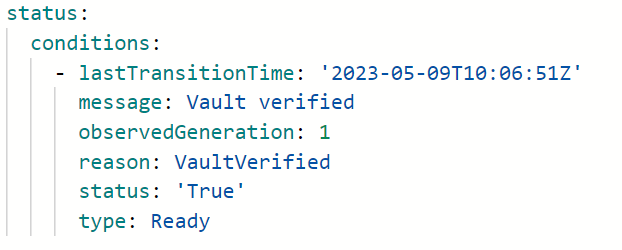

- From Certificate

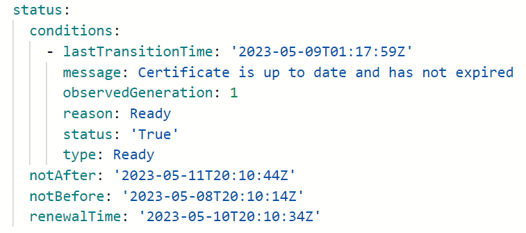

- Lets check if External-secrets was able to connect with the vault

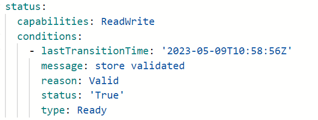
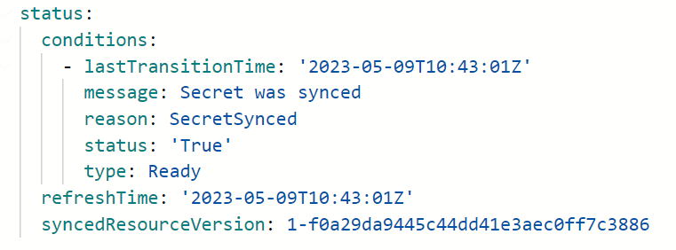

- Docker registry Secret created by External-secrets

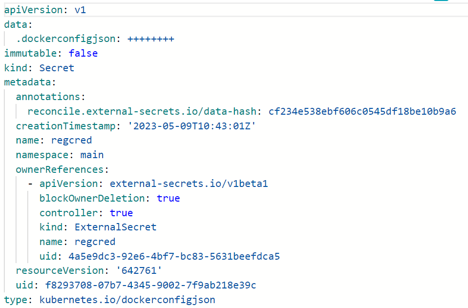

- Let's test the values of helm charts if we can set some values and see the effect, for example, I will change the desired pods count from 1 to 2 and change the hostname of dev to dev new.
- Before

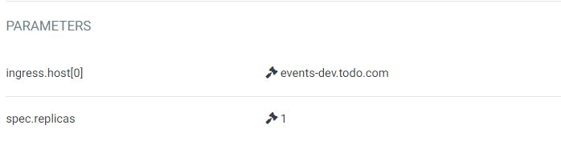
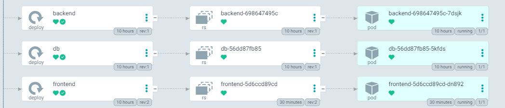
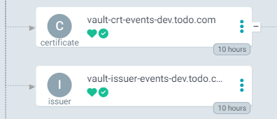

- After

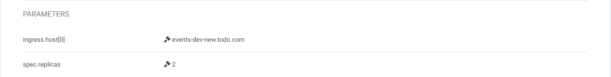
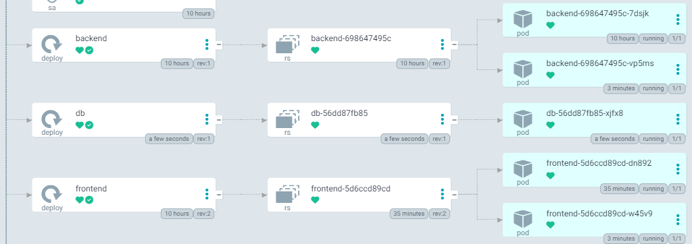
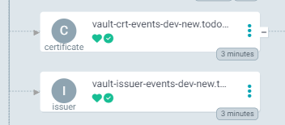

- Let's test the GitHub actions with some cases. Assume that I am a developer For example, I will make a little edit on file and commit it on stage, backend folder.

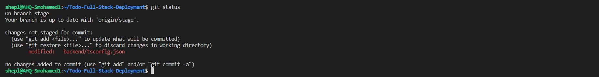
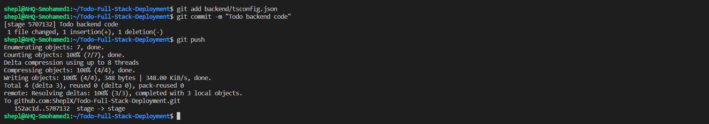

- From the action section, we can see that the backend workflow triggered the new commit `5707132` pushed to the stage branch and started the pipeline

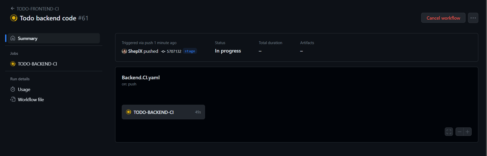

- And its done

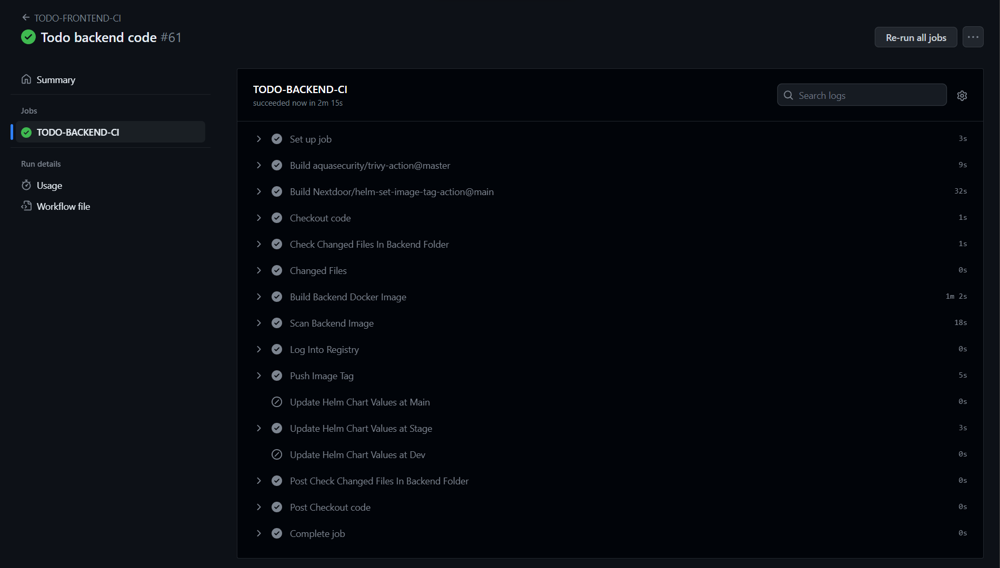

- Lets check the pipeline steps
    - Job 1 - will query all the changed files inside backend folder
    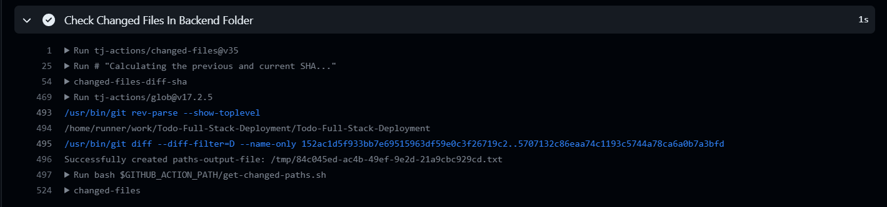
    - Job 2 - according to the previous step, it will print the changed files. in my case, I only made some changes on `backend/tsconfig.json` file.
    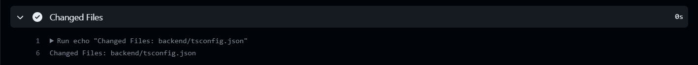
    - Job 3 - according to the previous step, it will print the changed files. in my case, I only made some changes on `backend/tsconfig.json` file.
    